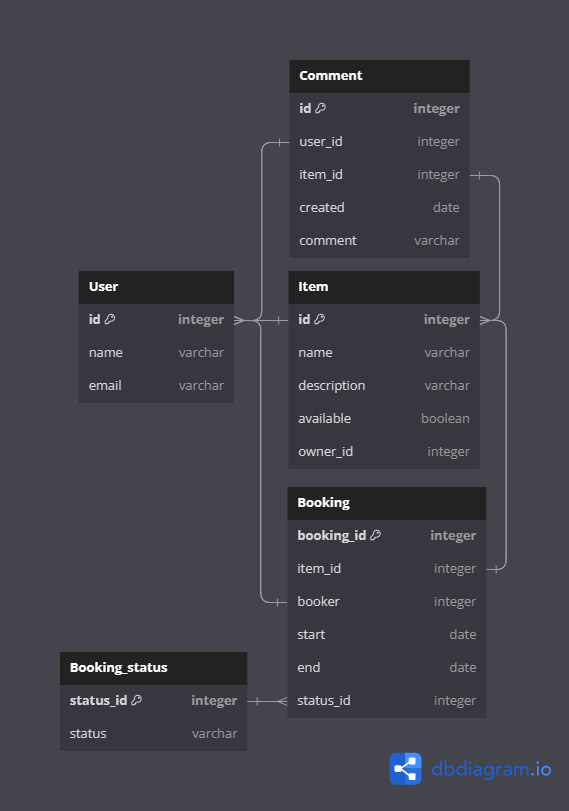

# Java-shareit project

Данный проект - сервис для шеринга (от англ. share — «делиться») вещей, он обеспечивает пользователям, во-первых,
возможность рассказывать, какими вещами они готовы поделиться, а во-вторых, находить нужную вещь и брать её в аренду.
Сервис должен не только позволять бронировать вещь на определённые даты, но и закрывать к ней доступ на время
бронирования от других желающих. На случай, если нужной вещи на сервисе нет, у пользователей должна быть возможность
оставлять запросы: вдруг древний граммофон, который странно даже предлагать к аренде, неожиданно понадобится для
театральной постановки. По запросу можно будет добавлять новые вещи для шеринга.

# Технологии
Java, SpringBoot, Maven, JUnit, RESTful API, Postgresql, Doker, Shell, MockMVC.

## Описание функционала
Приложение ShareIt состоит из двух частей, которые общаются друг с другом через REST:
- shareIt-server;
- shareIt-gateway.

## Установка и запуск проекта
Необходимо настроенная система виртуализации, установленный Docker Desktop(скачать и установить можно с официального сайта https://www.docker.com/products/docker-desktop/)

- Клонируйте репозиторий проекта на свою локальную машину:  
```git clone git@github.com:danyyyaa/java-shareit.git```

- Запустите командную строку и перейдите в корень директории с проектом.

- Соберите проект  
```mvn clean package```

- Введите следующую команду, которая подготовит и запустит приложение на вашей локальной машине  
```$  docker-compose up```

Приложение будет запущено на порту 8080. Вы можете открыть свой веб-браузер и перейти по адресу http://localhost:8080, чтобы получить доступ к приложению Share It.

Приложение shareIt-server содержит всю основную логику.
Во второе приложение shareIt-gateway вынесены контроллеры, с которыми непосредственно работают пользователи, вместе
с валидацией входных данных.

1. Класс ItemController - в нём сосредоточен весь REST-интерфейс для работы с вещью.
    - POST /items - добавление новой вещи. На вход поступает объект ItemDto. userId в заголовке X-Sharer-User-Id —
      это идентификатор пользователя, который добавляет вещь. Именно этот пользователь — владелец вещи.
      Идентификатор владельца будет поступать на вход в каждом из запросов, перечисленных далее.
    - PATCH /items/{itemId} - редактирование вещи. Изменить можно название, описание и статус доступа к аренде.
      Редактировать вещь может только её владелец.
    - GET /items/{itemId} - просмотр информации о конкретной вещи по её идентификатору. Информацию о вещи может
      просмотреть любой пользователь.
    - GET /items - просмотр владельцем списка всех его вещей с указанием названия и описания для каждой.
    - GET /items/search?text={text} - поиск вещи потенциальным арендатором. Пользователь передаёт в строке запроса текст,
      а приложение ищет вещи, содержащие этот текст в названии или описании, поиск возвращает только доступные для аренды вещи.

2. Класс BookingController - в нём реализован весь REST-интерфейс для работы с вещью.
    - POST /bookings - запрос может быть создан любым пользователем, а затем подтверждён владельцем вещи, после создания
      запрос находится в статусе WAITING.
    - PATCH /bookings/{bookingId}? - подтверждение или отклонение запроса на бронирование. Может быть выполнено только
      владельцем вещи. Затем статус бронирования становится либо APPROVED, либо REJECTED.
    - GET /bookings/{bookingId} - получение данных о конкретном бронировании (включая его статус). Может быть выполнено
      либо автором бронирования, либо владельцем вещи.
    - GET /bookings?state={state} -Получение списка всех бронирований текущего пользователя. Параметр state необязательный
      и по умолчанию равен ALL (англ. «все»). Также он может принимать значения:
        - CURRENT (англ. «текущие»),
        - PAST (англ. «завершённые»),
        - FUTURE (англ. «будущие»),
        - WAITING (англ. «ожидающие подтверждения»),
        - REJECTED (англ. «отклонённые»).
          Бронирования должны возвращаться отсортированными по дате от более новых к более старым.
    - GET /bookings/owner?state={state} - получение списка бронирований для всех вещей текущего пользователя. Этот запрос
      имеет смысл для владельца хотя бы одной вещи. Работа параметра state аналогична его работе в предыдущем сценарии.
    - POST /items/{itemId}/comment - комментарий можно добавить по эндпоинту.

3. Класс ItemRequestController
    - POST /requests — добавить новый запрос вещи. Основная часть запроса — текст запроса, где пользователь описывает,
      какая именно вещь ему нужна.
    - GET /requests — получить список своих запросов вместе с данными об ответах на них.
      Для каждого запроса указываются описание, дата и время создания и список ответов в формате: id вещи, название,
      её описание description, а также requestId запроса и признак доступности вещи available. Так в дальнейшем,
      используя указанные id вещей, можно будет получить подробную информацию о каждой вещи.
      Запросы возвращаются в отсортированном порядке от более новых к более старым.
    - GET /requests/all?from={from}&size={size} — получить список запросов, созданных другими пользователями.
      С помощью этого эндпоинта пользователи смогут просматривать существующие запросы, на которые они могли бы ответить.
      Запросы сортируются по дате создания: от более новых к более старым. Результаты должны возвращаться постранично.
      Для этого нужно передать два параметра: from — индекс первого элемента, начиная с 0,
      и size — количество элементов для отображения.
    - GET /requests/{requestId} — получение данных об одном конкретном запросе вместе с данными об ответах на него в том
      же формате, что и в эндпоинте GET /requests. Посмотреть данные об отдельном запросе может любой пользователь.

## Описание базы данных
На диаграмме ниже представлен визуальный обзор базы данных Java-shareit и связей между таблицами.



Ниже приведен обзор таблиц базы данных:
- users: содержит данные о пользователях.
- requests: : содержит данные запросах вещей.
- items: содержит данные о вещах.
- comments: содержит данные о комментариях.
- bookings: содержит данные о вещах.

### Тестирование

В данном проекте реализовано 125 тестов:
- юнит-тесты для кода, содержащего логику, при необходимости с использованием моков.
- интеграционные тесты, проверяющие взаимодействие с базой данных.
- тесты для всех REST-эндпоинтов приложения с использованием MockMVC.
- тесты для работы с JSON для DTO с помощью аннотации @JsonTest.

### Иструкция по запуску локально

1. Установить Doker
2. Сохранить проект Shareit на устройстве
3. Убедитесь, что порты указанные в docker-compose.yml свободны на устройстве
4. Если временная зона пользователя отличается от UTC+0, то указать нужную временную зону в файле server/Dockerfile.
5. Для создания jar файлов запустите скрипт createdockerbuild.ch
6. Для создания и запуска Doker образа запустите скрипт createjar.ch
7. Запустите локально API тесты